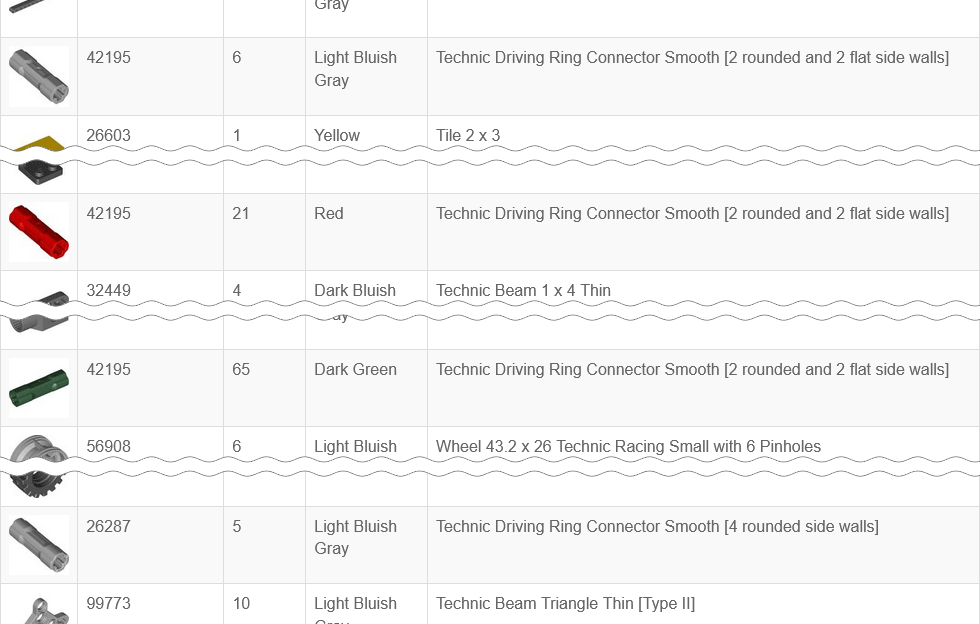

- [Installation](#installation)
- [Usage](#usage)
  - [Table Structure](#table-structure)
  - [Merge Options](#merge-options)
  - [Filter Options](#filter-options)

One of many great features, provided by Rebrickable, is possibility to compose a list of all your parts, so you can check how many particular parts you have, in which colors, etc.

Rebrickable even provides possibility to export all parts as a single plain table, which then can be used offline. In some cases this may be more convenient or faster than using the site.

There is one issue with this table though: it lacks flexibility when you need a more general overview of the parts you have. All part colors, molds, prints, patterns are listed there separately.

Suppose you are prototyping something and you want to know how many Technic connectors <a href="https://rebrickable.com/parts/42195/">42195</a> you have. If you have this part in more than one color, there will be multiple rows for it, scattered over the table. If you are more "lucky", there will even be rows with an older mold variant <a href="https://rebrickable.com/parts/26287/">26287</a>:



But you just want to know how many such connectors you have, regardless of their color or molds, which you may not even know they exist.

This is where RBmerge may be handy. Given a table with all your parts as an input, it transforms table by merging together all the same parts, which have just different colors. Then, basing on your preference, it also merges molds, patters, prints, alternate parts.

This is how the row for part 42195, mentioned above, may look after transforming table by RBmerge:


Now all part variants are listed together while still retaining some stats about variations. For example, you still can check how many colors are there, or how many molds and parts per mold. Detailed description of the table structure can be found in the [Table Structure](#table-structure) topic.

To resolve mold variants, prints, patters, and alternate parts RBmerge uses parts relationships from [Rebrickable Downloads](https://rebrickable.com/downloads/).

# Installation

First you need to export HTML table with all your parts from Rebrickable.

Log in to Rebrickable. Go to `My LEGO` → `All My Parts` → `Export Parts` → `HTML Table`:


This will load a table with all your parts.

Save it to a file, and, when saving, select "HTML Only" (available in all major browsers). Now open saved HTML file in a text editor and add this line before closing `</body>` tag (for the info, `'+'` (plus) sign at the beginning of the line is used for highlighting and should not be added to the file):

```diff
 <script type="text/javascript" src="https://rebrickable.com/static/plugins/jquery/jquery-3.5.1.min.js"></script>
 <script type="text/javascript" src="https://rebrickable.com/static/plugins/lazyload/jquery.lazyloadxt.extra.min.js"></script>
+<script type="text/javascript" src="https://ojuuji.github.io/rbmerge/js/rbmerge.min.js"></script>
 </body>
```

This way you will have single HTML file, which requests all necessary assets from the Internet. Normally it requests them only once and then they are cached, so after the first open you should be able to use it without the Internet access.

Alternatively, if you want to keep assets locally, you can select "Complete Webpage" when saving HTML. In this case browser saves all assets to `<filename>_files` directory placed along with the saved HTML file. You can download [rbmerge.min.js](js/rbmerge.min.js) to this directory and refer it in the saved HTML file the following way. In this example HTML was saved as `My Parts.html`:

```diff
 <script type="text/javascript" src="My Parts_files/jquery-3.5.1.min.js"></script>
 <script type="text/javascript" src="My Parts_files/jquery.lazyloadxt.extra.min.js"></script>
+<script type="text/javascript" src="My Parts_files/rbmerge.min.js"></script>
 </body>
```

However note that even in the second case images will be downloaded from the Internet instead of using local copies. To prevent this without using extra tools you can do, for example, the following.

Before saving complete HTML scroll table to the end to force browser to download and display all part images. Use the `PageDown` key to make all images to be visible and thus downloaded. I.e. do not use, for example, the `End` key otherwise some images may be missing. Tip: you can zoom out the page as much as possible so visible area will contain maximum possible number of images and you will need to press the `PageDown` key fewer times.

Then, after saving complete HTML, when editing it also remove `jquery.lazyloadxt` script:

```diff
 <script type="text/javascript" src="My Parts_files/jquery-3.5.1.min.js"></script>
-<script type="text/javascript" src="My Parts_files/jquery.lazyloadxt.extra.min.js"></script>
+<script type="text/javascript" src="My Parts_files/rbmerge.min.js"></script>
 </body>
```

This way it becomes truly local and never performs any Internet requests.

# Usage

When processing parts list, script resolves every part to so-called _reference_ part. All parts, which have the same reference part, are merged together.

Part is resolved to the reference part if it meets any of these criteria:
- it has different color but the same part number as the reference part
- (optionally) it is print, pattern, mold, or alternative of the reference part

Which one becomes the reference part in case of molds and alternatives is decided basing on the parts usage in the sets and the years when it was used. Basically it will be either a part with the most recent year or, if there are multiple parts with the same year, the one that is referenced in more sets.

## Table Structure

Table consists of four columns:

```
| Ref Part Num (<N>) | Quantity (<M>) | Colors | Description |
```

where `<N>` is total number of reference parts (total number of rows) in the table, and `<M>` is total number of parts at all. `<M>` actually equals to the number of parts on Rebrickable page `All My Parts`, for example:

|||
|---|---|
|Example of the table header|Parts count on Rebrickable|

Each row contains single and unique reference part number in `Ref Part Num` column. They are unique because colors are always merged regardless of the merge options, which are described below.

## Merge Options

TBD

## Filter Options

TBD
