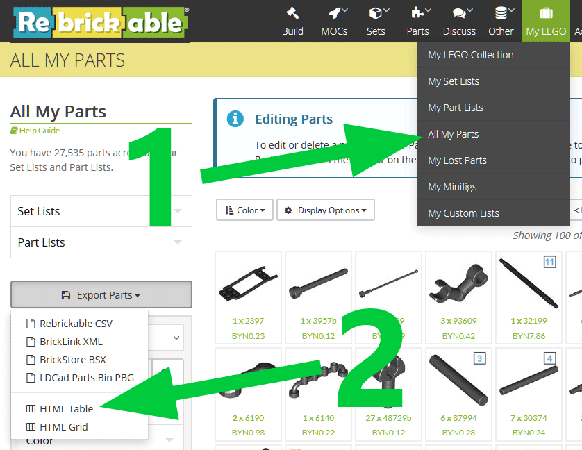

# Installation

First you need to export HTML table with all your parts from Rebrickable.

Log in to Rebrickable. Go to `My LEGO` → `All My Parts` → `Export Parts` → `HTML Table`:



This will load a table with all your parts.

Save it to a file, and, when saving, select "HTML Only" (available in all major browsers). Now open saved HTML file in a text editor and add this line before closing `</body>` tag (for the info, `'+'` (plus) sign at the beginning of the line is used for highlighting and should not be added to the file):

```diff
 <script type="text/javascript" src="https://rebrickable.com/static/plugins/jquery/jquery-3.5.1.min.js"></script>
 <script type="text/javascript" src="https://rebrickable.com/static/plugins/lazyload/jquery.lazyloadxt.extra.min.js"></script>
+<script type="text/javascript" src="https://ojuuji.github.io/rbmerge/assets/js/rbmerge.min.js"></script>
 </body>
```

This way you will have single HTML file, which requests all necessary assets from the Internet. Normally it requests them only once and then they are cached, so after the first open you should be able to use it without the Internet access.

Alternatively, if you want to keep assets locally, you can select "Complete Webpage" when saving HTML. In this case browser saves all assets to `<filename>_files` directory placed along with the saved HTML file. You can download [rbmerge.min.js](../assets/js/rbmerge.min.js) to this directory and refer it in the saved HTML file the following way. In this example HTML was saved as `My Parts.html`:

```diff
 <script type="text/javascript" src="My Parts_files/jquery-3.5.1.min.js"></script>
 <script type="text/javascript" src="My Parts_files/jquery.lazyloadxt.extra.min.js"></script>
+<script type="text/javascript" src="My Parts_files/rbmerge.min.js"></script>
 </body>
```

However note that even in the second case images will be downloaded from the Internet instead of using local copies. To prevent this without using extra tools you can do, for example, the following.

Before saving complete HTML scroll table to the end to force browser to download and display all part images. Use the `PageDown` key to make all images to be visible and thus downloaded. I.e. do not use, for example, the `End` key otherwise some images may be missing. Tip: you can zoom out the page as much as possible so visible area will contain maximum possible number of images and you will need to press the `PageDown` key fewer times.

Then, after saving complete HTML, when editing it also remove `jquery.lazyloadxt` script:

```diff
 <script type="text/javascript" src="My Parts_files/jquery-3.5.1.min.js"></script>
-<script type="text/javascript" src="My Parts_files/jquery.lazyloadxt.extra.min.js"></script>
+<script type="text/javascript" src="My Parts_files/rbmerge.min.js"></script>
 </body>
```

This way it becomes truly local and never performs any Internet requests.
