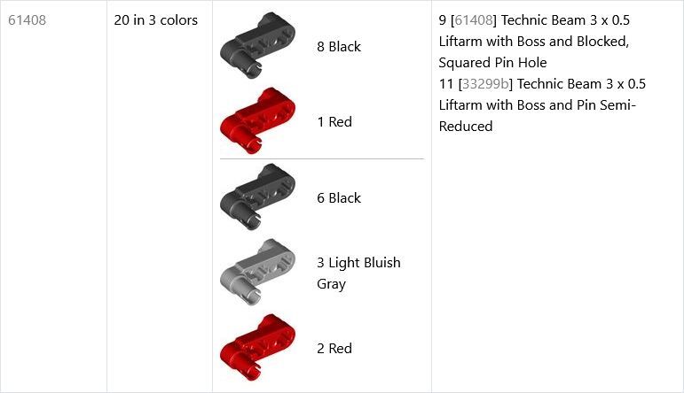

# Help

- [Table Structure](#table-structure)
  - [Header](#header)
  - [Column #1: Reference Part Number](#column-1-reference-part-number)
  - [Column #2: Number of Parts](#column-2-number-of-parts)
  - [Column #3: Colors](#column-3-colors)
  - [Column #4: Description](#column-4-description)
- [Merging Parts](#merging-parts)
  - [Merge Options](#merge-options)
- [Filtering Parts](#filtering-parts)
  - [Filter Options](#filter-options)

## Table Structure

Each row contains single and unique reference part number and a group of actual parts from the inventory, which resolve to this reference part.

All part numbers everywhere in the table are hyperlinks to corresponding parts on Rebrickable.

### Header

Table consists of four columns:

1. **Reference Part Number**. As a header is used total number of the reference parts (total number of rows) in the table.
2. **Number of Parts** in the group. As a header is used total number of parts in whole inventory.
3. **Colors**. Header is an edit box which acts as a filter for the color names.
4. **Description**. Header is an edit box which acts as a filter for the part names.

Example:

### Column #1: Reference Part Number

Each row contains single and unique reference part number. They are unique because colors are always merged regardless of the merge options.

Process of resolving the reference part does not depend on the inventory, so the reference part may not even exist in it.

In fact, it may not even exist at all. This is common situation for prints and patterns. For example, [35074pr0003](https://rebrickable.com/parts/35074pr0003/) and [35074pr0009](https://rebrickable.com/parts/35074pr0009/) both are prints of the same part but unprinted part `35074` does not exist.

In such cases, even if the reference part does not exist, nothing actually prevents from using it for the parts merging anyway.

### Column #2: Number of Parts

Each row represents group of parts with the same reference part. This column contains number of parts in this group.

When there are more than one color in the group, number of colors is appended to the number of parts. For example, "5 in 2 colors". Only unique colors are counted. For example, molds with the same color will not increase this number. So it may be less than the number of parts listed in `Colors` column.

For example, the following group has five combinations of the partnum+color in the `Colors` column, but there are only three unique colors:

### Column #3: Colors

Each row contains images and color names for all parts in the group.

Each part number and color is listed there separately and includes its image and the number of parts in this color.

Parts are grouped by the part number and relation type. So, for example, on the screenshot above first are listed all colors of part `61408` and then all colors of part `33299b`.

Parts with the same part number are sorted by the color (technical details: [`rbm_colors.csv`](https://github.com/ojuuji/rbmerge/blob/master/tables/readme.md#rbm_colorscsv)). So the parts order is consistent across all parts in the inventory.

### Column #4: Description

For each part in the group this column contains name of the part and the number of these parts in the inventory.

If there are more than one part number in the group, or if the part number differs from the reference part number in first column, then description also includes part number in the square brackets (see screenshot in `Column #2` above for example).

In case of multiple part numbers they are listed in the same order as in `Column #3`.

## Merging Parts

The same parts of different colors are merged unconditionally. Then, basing on the merge options, additional part relationships are considered for merging.

How this is done. When processing parts list, every part is resolved to so-called _reference part_. Then all parts with the same reference part are merged together.

Part is resolved to the reference part if it meets any of these criteria:
- It has different color but the same part number as the reference part.
- It is print, pattern, mold, or alternate of the reference part. This can be configured by the merge options.

For the prints and patterns the reference part is always the plain one.

Which one becomes the reference part in case of molds and alternates is decided basing on the part usage in the sets and the years when it was used. Basically it will be either a part with the most recent year or, if there are multiple parts with the same year, the one that is referenced in more sets (technical details: [`rbm_part_relationships.csv`](https://github.com/ojuuji/rbmerge/blob/master/tables/readme.md#rbm_part_relationshipscsv)).

### Merge Options

Merging is based on the part relationships data from Rebrickable. As a result, the merge options directly reflect some of the build matching options on Rebrickable.

Available merge options:
- **prints** and **patterns**. Rebrickable uses these relationships together in the build matching option _"Ignore printed and patterned part differences"_. In RBmerge these are two separate options (it was just easier to do it this way).
- **molds**. Rebrickable uses this relation in the build matching option _"Ignore mold variations in parts"_.
- **alternates**. Rebrickable uses this relation in the build matching option _"Consider alternate parts that can usually be used as replacements, but are not always functionally compatible"_.
- **extra**. This enables extra relationships, maintained within RBmerge (technical details: [`part_relationships_ex.csv`](https://github.com/ojuuji/rbmerge/blob/master/tables/readme.md#part_relationships_excsv)). Particular relationship type from extras is applied only if this type is generally enabled. For example, in order for extra mold relationships to be applied need to enable both **molds** and **extra** options.

## Filtering Parts

Rows in the table can be filtered by the color names and by the part names, separately. The filter edit boxes are combined with corresponding column headers.

Filtering only considers color and part names. Other text, found in these columns, i.e. numbers of parts and the part numbers, is ignored by the filters.

Filtering is case-insensitive.

Every word from the filter is matched separately. Text (i.e. the color name or the part name) is considered as matched if it contains all words from the filter.

### Filter Options

Option `Use smart matching`, which is enabled by default, applies two additional constraints:
1. When matching next word from the filter, it forbids reuse of text parts already matched by the previous words.
2. If a filter word is a number, it must match an entire word from the text.

Suppose you entered part name filter "1 x 1". Without this option filtered results would have part containing at least one "1" anywhere, e.g. `Axle Hose, Soft 12L` or `Plate 2 x 14`. However, with this option a part name will match only if it contains two whole words "1":

|Example of "1 x 1" filter with smart matching|Example of "1 x 1" filter without smart matching|
|---|---|
|||

By default only parts, which matched filters, are retained in the table. By setting option `Apply to groups instead of individual parts` this behavior can be changed to leave whole part groups to which the matched parts belong. In other words, leave entire rows intact if they contain matched parts.
