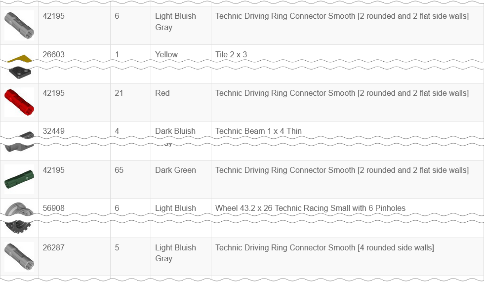

# Home

One of many great features, provided by Rebrickable, is possibility to compose a list of all your parts, so you can check how many particular parts you have, in which colors, etc.

Rebrickable even provides possibility to export all parts as a single plain table, which then can be used offline.

In some cases this may be more convenient or faster than using the site. Though it may not be as convenient as it could be, because all part colors, molds, prints, patterns are listed there separately.

Suppose you are prototyping something and you want to know how many Technic connectors <a href="https://rebrickable.com/parts/42195/">42195</a> you have. If you have this part in more than one color, there will be multiple rows for it, scattered over the table. If you are more "lucky", there will even be rows with an older mold variant <a href="https://rebrickable.com/parts/26287/">26287</a>:

But you just want to know how many such connectors you have, regardless of their colors or molds, which you may not even know they exist.

This is where RBmerge may be handy. Given a table with all your parts as an input, it transforms table by merging together all the same parts, which have just different colors. Then, basing on your preference, it also merges prints, patters, molds, and alternates.

This is how the row for part 42195, mentioned above, may look before and after merging table by RBmerge:

|Example of part 42195 in original table|Example of part 42195 in merged table|
|---|---|
|||

In the merged table all part variants are listed together while still retaining info about variations. For example, you still can check how many colors are there, or how many molds and parts per mold. Detailed description of the table structure can be found in the [Help → Table Structure](help/#table-structure) topic.

To resolve mold variants, prints, patters, and alternate parts RBmerge uses parts relationships from [Rebrickable Downloads](https://rebrickable.com/downloads/).
