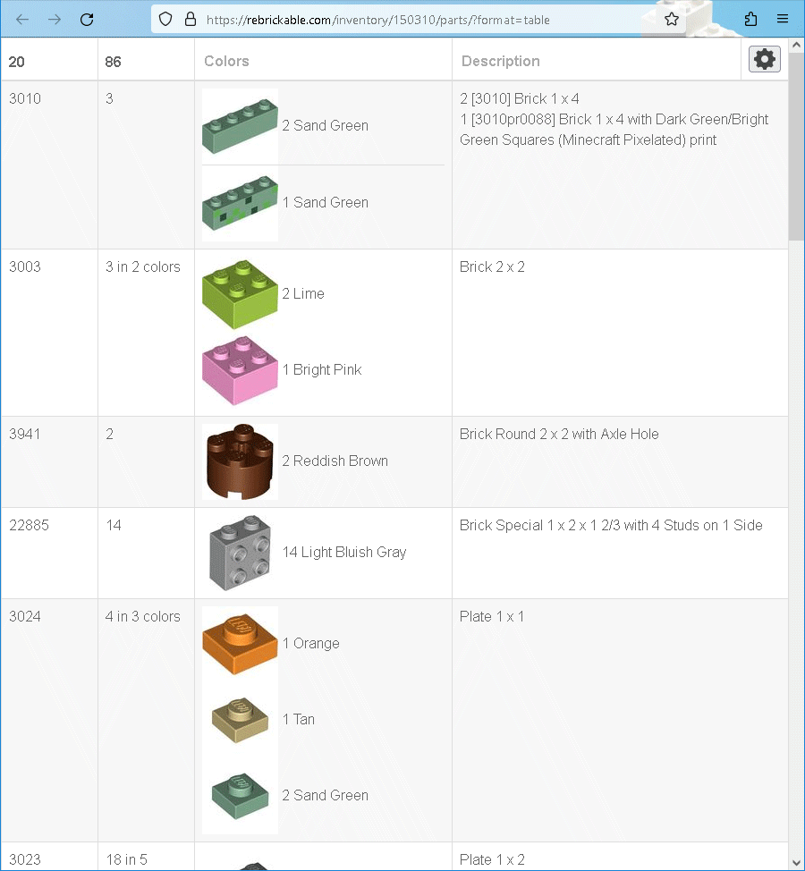
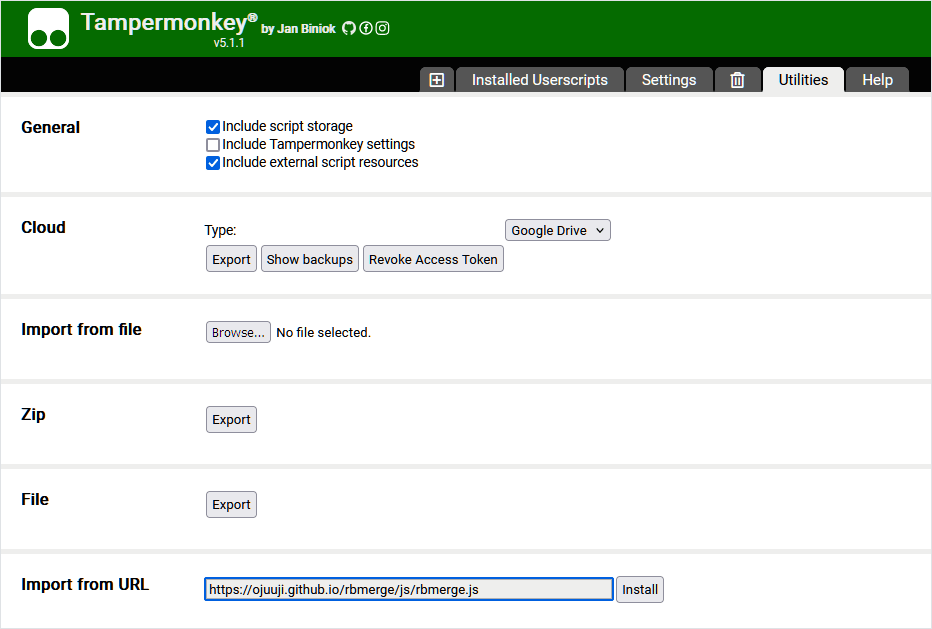

# Script

- [Userscript Installation](#userscript-installation)
- [Manual Installation](#manual-installation)

Script is expected to be injected into the parts HTML table generated by Rebrickable.

Here is an example for the [parts HTML table](https://rebrickable.com/inventory/150310/parts/?format=table) of the [Set 40624](https://rebrickable.com/sets/40624-1/):

|Before|After|
|---|---|
|[](../images/set_40624_original.png)|[](../images/set_40624_merged.png)|

Structure of the table and configuration options are described in the [Help](../help/). This page describes only installation of the script.

## Userscript Installation

Userscript is the most powerful way to use this script. Once installed, you will have RBmerge functionality in HTML tables exported from the following pages:
- Inventories (Sets, MOCs, Alternate Builds)
- `My LEGO` → `All My Parts`
- `My LEGO` → `My Part Lists`
- `My LEGO` → `My Part Lists` → `<Some-List>`
- `My LEGO` → `My Lost Parts`
- `My LEGO` → `My Custom Lists` → `<Some-List>`
- `Sets` → `Compare Sets`

I.e. you just click there `Export Parts` → `HTML Table` and instead of plain table you get a merged one.

To get this working you will need a [userscript manager](https://en.wikipedia.org/wiki/Userscript_manager).

For example, to install script in Tampermonkey, open its Dashboard, then go to `Utilities` tab, paste [rbmerge.js](../js/rbmerge.js) URL in edit box `Import from URL` and click `Install` button:



Userscript manager handles auto update for the scripts, so you will not need to do anything else.

## Manual Installation

In this guide will be used HTML table with all your parts. This was actually very first usage scenario of RBmerge, before an app and userscript were introduced.

So, first you need to export all your parts as HTML table. Log in to Rebrickable and go to `My LEGO` → `All My Parts` → `Export Parts` → `HTML Table`:


This will load a table with all your parts.

Save it to a file, and, when saving, select "HTML Only" (available in all major browsers). Now open saved HTML file in a text editor and add this line before closing `</body>` tag (for the info, `'+'` (plus) sign at the beginning of the line is used for highlighting and should not be added to the file):

```diff
 <script type="text/javascript" src="https://rebrickable.com/static/plugins/jquery/jquery-3.5.1.min.js"></script>
 <script type="text/javascript" src="https://rebrickable.com/static/plugins/lazyload/jquery.lazyloadxt.extra.min.js"></script>
+<script type="text/javascript" src="https://ojuuji.github.io/rbmerge/js/rbmerge.js"></script>
 </body>
```

That's all. Now you have single HTML file, which requests all necessary assets from the Internet. Normally it requests them only once and then they are cached, so after the first open you should be able to use it without the Internet access.

Alternatively, if you want to keep assets locally, you can select "Complete Webpage" when saving HTML. In this case browser saves all assets to `<filename>_files` directory placed along with the saved HTML file. You can download [rbmerge.js](../js/rbmerge.js) to this directory and refer it in the saved HTML file the following way. In this example HTML was saved as `My Parts.html`:

```diff
 <script type="text/javascript" src="My Parts_files/jquery-3.5.1.min.js"></script>
 <script type="text/javascript" src="My Parts_files/jquery.lazyloadxt.extra.min.js"></script>
+<script type="text/javascript" src="My Parts_files/rbmerge.js"></script>
 </body>
```

However note that even in the second case images will be downloaded from the Internet instead of using local copies. To prevent this without using extra tools you can do, for example, the following.

Before saving complete HTML you need to scroll table to the end to force browser to download and display all images. Use the `PageDown` key to make all images to be visible and thus downloaded. I.e. do not use, for example, the `End` key otherwise some images may be missing. Tip: you can zoom out the page as much as possible so visible area will contain maximum possible number of images and you will need to press the `PageDown` key fewer times.

Then, after saving complete HTML, when editing it also remove `jquery.lazyloadxt` script:

```diff
 <script type="text/javascript" src="My Parts_files/jquery-3.5.1.min.js"></script>
-<script type="text/javascript" src="My Parts_files/jquery.lazyloadxt.extra.min.js"></script>
+<script type="text/javascript" src="My Parts_files/rbmerge.js"></script>
 </body>
```

This way it becomes truly local and never performs any Internet requests.
